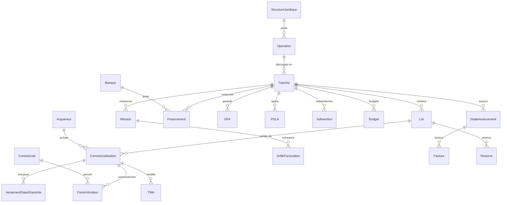

# Modèle de données hérité (WinDev / SQL Server)

Reconstitué le 2026-07-04 à partir du premier `PromoComm.bak` (172 tables, ~70 000 lignes) :
46 clés étrangères déclarées dans SQL Server + ~70 relations implicites retrouvées par
convention de nommage et **validées contre les données** (taux d'orphelins ≈ 0) via
`scripts/analyse-relations.ts`. Domaine : promotion immobilière.

Convention cible : les préfixes `t` des noms de tables (`tOperation`, `tLot`…) **ne sont
pas repris** dans le futur schéma `public` → `operation`, `tranche`, `lot`, etc.

## 1. Colonne vertébrale : opération > tranche > lot

```
tStructureJuridique (138)   la SCCV/société qui porte l'opération
        ▲ IDStructureJuridique
tOperation (167)            programme immobilier (libellé, commune, adresse, ZAC…)
        ▲ IDOperation
tTranche (213)              phase de l'opération (nb logements indiv/coll, livraison, avancement…)
        ▲ IDTranche
tLot (3 141)                lot vendable (n° lot, type de bien, surfaces, étage, prix…)
```

- `tLot.IDDestination` → `tDestination` (usage du lot) ; `tLot.FamilleDeBien`, `TypeDeBien` → nomenclatures `tListeTypeBien`/`tFamilleDeBien`.
- Attention à la casse héritée : la PK de `tLot` s'appelle `IDlot` (l minuscule).
- Dénormalisations WinDev à ne pas reprendre : `tLot.curIDAcquereur`, `tLot.curIDCommercialisation`, `tOperation.curNbLot`, `curNbTranche`… (des caches « valeur courante », recalculables).

## 2. Dimension commerciale

Pivot : **`tCommercialisation` (2 945) = IDLot + IDAcquereur** + cycle de vie de la vente
(DateResa, DatePrevueSignatureActe, DateSignatureActeVEFA, DateLeveeOption, DateLivraison, DateAnnulation, moyen de paiement, fiscalité).

| Table                                 | Relation validée                                                   | Rôle                                                                         |
| ------------------------------------- | ------------------------------------------------------------------ | ---------------------------------------------------------------------------- |
| `tAcquereur` (2 929)                  | ← `tCommercialisation.IDAcquereur`                                 | acheteur (état civil, CSP ×2, situation famille, ressources, type de ménage) |
| `tCommVendeur` (5 157)                | `IDCommercialisation`, `IDLot`, `IDCommercial`                     | commissions des vendeurs (taux, montant, événement, règlement)               |
| `tCommercial` (30)                    | ← `tCommVendeur.IDCommercial`, `tAcquereur.IDConseillerCommercial` | force de vente                                                               |
| `tVersementDepotGarantie` (1 676)     | `IDCommercialisation`                                              | dépôts de garantie versés                                                    |
| `tTMA` (178)                          | `IDCommercialisation`                                              | travaux modificatifs acquéreur                                               |
| `tGrilleHonoCom` (0)                  | `IDCommercialisation`                                              | grille honoraires commercialisation (vide)                                   |
| `tCommercialisation.IDBanqueCourtage` | → `BanqueCourtage`                                                 | courtage du financement acquéreur                                            |

Nomenclatures : `tListeFiscaliteAcquereur`, `MoyenDePaiement`, `SituationFamille`, `SituationFamiliale`, `CSP`, `TypeDeMenage`, `TypeLogementActuel`, `tAcquereurTrancheAge`, `tAcquereurPlafondRessources`, `tAcquereurRevenuFoyerFiscalParQuartile`, `NatureJuridique`.

`tAcquereur` contient aussi des colonnes `Import*` (reprise d'un ancien logiciel PromoGes) — sans valeur métier pérenne.

## 3. Dimension financière (portée par la tranche)

Presque tout s'accroche à `IDTranche` (souvent avec un booléen `SurOpe` = « au niveau opération ») :

| Table                                                | Relations validées                                                                       | Rôle                                                                             |
| ---------------------------------------------------- | ---------------------------------------------------------------------------------------- | -------------------------------------------------------------------------------- |
| `tFinancement` (228)                                 | `IDTranche`, `IDBanque`, `IDTypeFinancement`, `IDListeFinPret`, `IndexTaux`→`tIndextaux` | prêts bancaires : montant, dates de mobilisation, marge, commission d'engagement |
| `tBanque` (17)                                       | —                                                                                        | établissements                                                                   |
| `tCompteBanque` (195)                                | `IDBanque`, `IDStructureJuridique`, `IDTypeCompteBanque`, `IDUtilisationCompte`          | comptes bancaires des structures                                                 |
| `tGFA` (108)                                         | `IDTranche`, `IDBanque`                                                                  | garantie financière d'achèvement (taux, caution, fonds de garantie)              |
| `tPSLA` (101)                                        | `IDTranche`, `IDBanque`, `OrganismeAgrément`                                             | location-accession : agréments, garanties d'emprunt                              |
| `tDeblocagePSLA` (357)                               | —                                                                                        | déblocages PSLA                                                                  |
| `tSubvention` (224) / `tSubvention2` (218)           | `IDTranche`, `IDCategorieSubvention`, `IDOrganismeSubvention`                            | subventions (deux générations de la table — arbitrer laquelle est vivante)       |
| `tDeblocageSubvention` (291)                         | `IDSubvention`                                                                           | déblocages de subventions                                                        |
| `FraisFinancierPub` (694)                            | `IDTranche`, `IDCategorieFrais`                                                          | frais financiers publiés                                                         |
| `tRemboursementAnticipe` (613)                       | (à rattacher : porte sur les financements)                                               | remboursements anticipés                                                         |
| `tBudget` (264)                                      | `IDTranche`, `IDListeBudget`                                                             | budgets par tranche                                                              |
| `tSGA` (199)                                         | `IDTranche` (`IDBudget` invalide à 89 % — ne pas reprendre)                              | suivi de gestion                                                                 |
| `tDeclaration940` (124)                              | `IDTranche`                                                                              | déclarations fiscales                                                            |
| `tParticipation` (299)                               | `IDStructureJuridique`, `IDAssocie`, `IDIndexTaux_Remuneration`                          | parts des associés dans les SCCV                                                 |
| `tBilan_CAHT` / `_Resultat` / `_Stock` (207/607/428) | `IDStructureJuridique`                                                                   | agrégats comptables par société                                                  |

## 4. Suivi de production et facturation

- `tStadeAvancement` (6 935) : jalon réel par tranche — `IDTranche` + `IDListeAvancement` (nomenclature des 65 stades), dates prévues/réelles, % avancement.
- `tMission` (855) : missions facturables par tranche — `IDTranche`, `IDTypeMission`, `IDPrestataire`.
- `tGrilleFacturation` (1 259) : échéancier par mission — `IDMission` → `tMission` (0 orphelin). **Piège** : sa colonne `IDStadeAvancement` référence en réalité `tListeAvancement` (0 orphelin), pas `tStadeAvancement` (100 % orphelin).
- `tFacture` (1 653) : `IDStadeAvancement` → `tStadeAvancement` (le jalon réel, ici c'est le bon), `IDTypeMission`.
- `tHonoCommHFFacture` (645), `tHonoCommHFNatureAchat` (312) : honoraires hors forfait par tranche.
- `tReserve` (30 431 — la plus grosse table) : réserves de livraison par lot — `IDLot`, `IDTypeReserve`, `IDEntreprise` → `tReserveEntreprise` (281), `IDPiece`.
- `tPlanningStade`, `TypeBatimentStade`, `tStructureJuridique_Stade`, `ArchiveStadeAvancement` : paramétrage/archives du planning d'avancement.

## 5. À ne pas reprendre

- **Copies/archives** : `tAcquereur_copie`, `Copie de tCommercialisation`, `*_old` (`tSubvention_old`, `tCompteBanque_old`, `tVersementDepotGarantie_old`), `tAcquereur_ExportErrors`, `tMission2` (0 ligne, PK homonyme de `tMission` : source de confusion).
- **Techniques WinDev** : `Structure*` (méta-description de l'ancien logiciel), `REQ_*` (requêtes matérialisées), `sysdiagrams`, `NumEtageTemp`, `ImportLotPromoGes`, `DataLots`, `CommuneEtZonePourImport`.
- **Colonnes** : préfixes `cur*` (caches), `Import*`/`PromoGesNom` (reprise PromoGes), suffixes `_old`, colonne `N° Lot` (espace + caractère spécial).
- **35 tables vides** (dont `tEnqueteClient`, `tAssurancePNO`, `Contentieux`, `ModeleMail`…) : vérifier avec le client si fonctionnalité abandonnée ou jamais utilisée.
- Les rejets complets de l'analyse (`NbLot`, `NbTMA`, `curNb*`, `DontLogt*`…) sont des **compteurs**, pas des références — liste complète en sortie de `scripts/analyse-relations.ts`.

## 6. Diagramme (cœur du modèle)


